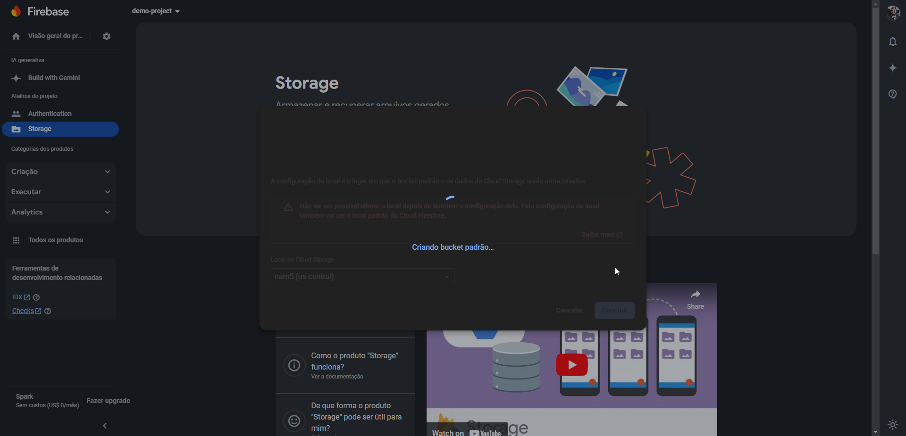
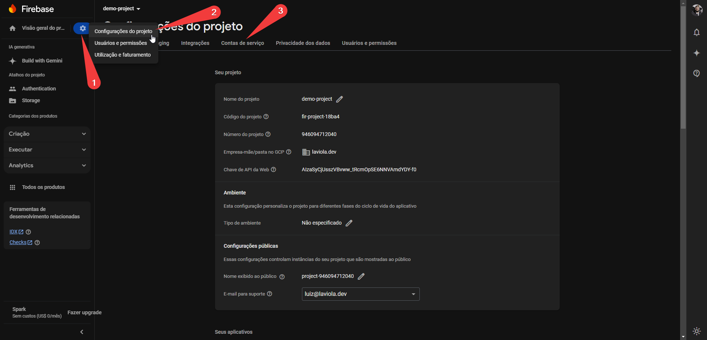

# Exemplo de Configuração do Firebase

Esta página visa auxiliar na configuração do Firebase para o projeto.

Siga os passos demonstrados nas imagens abaixo:

### Passo 01 

### Passo 02 

### Passo 03 

### Passo 04 

### Passo 05 

### Passo 06 

### Passo 07 

### Passo 08 

### Passo 09 

### Passo 10 

### Passo 11 

### Passo 12 

### Passo 13 

### Passo 14 

### Passo 15 

### Passo 16 

### Passo 17 

### Passo 18 

### Passo 19 

### Passo 20 

### Passo 21 

### Passo 22 

### Passo 23 

### Passo 24 

### Passo 25 

### Passo 26 

### Passo 27 

### Passo 28 

### Passo 29 

### Passo 30 

## Utilizar Firebase Storage 

❗❗❗ Caso não deseje utilizar o serviço de Storage do Firebase, ignore as etapas a seguir, retornando ao [README](./README.md).

### Passo 31 

### Passo 32 

