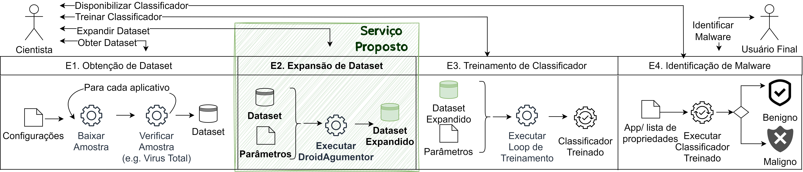
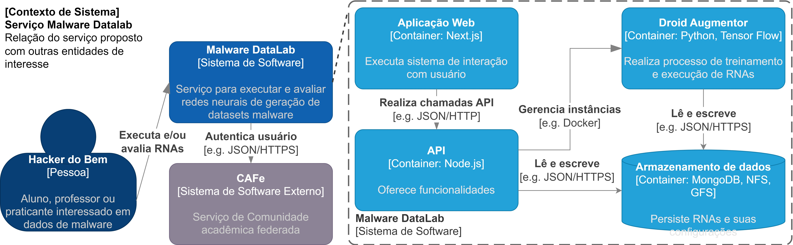
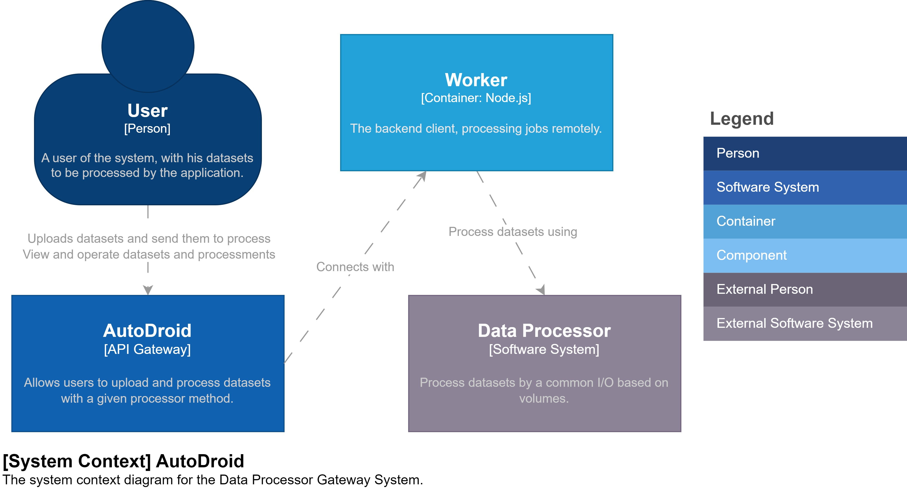
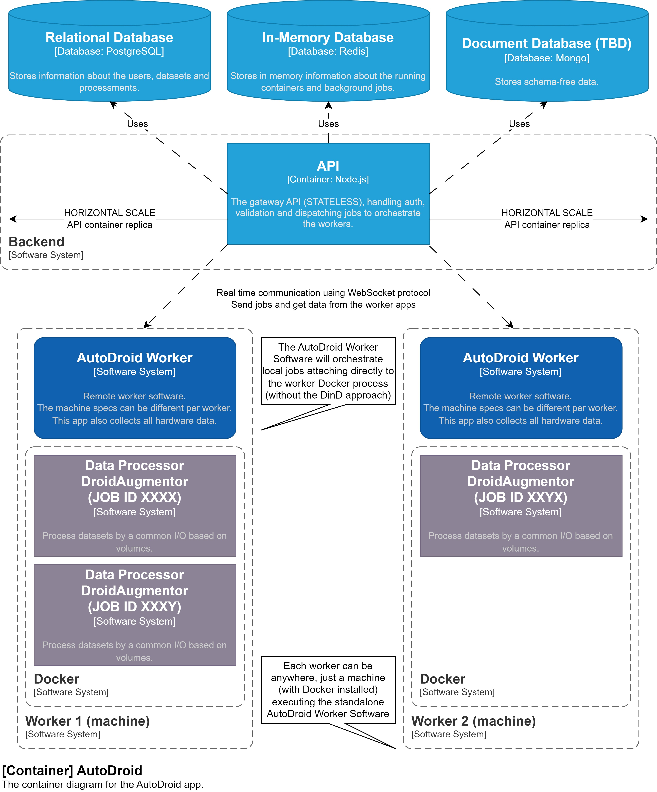
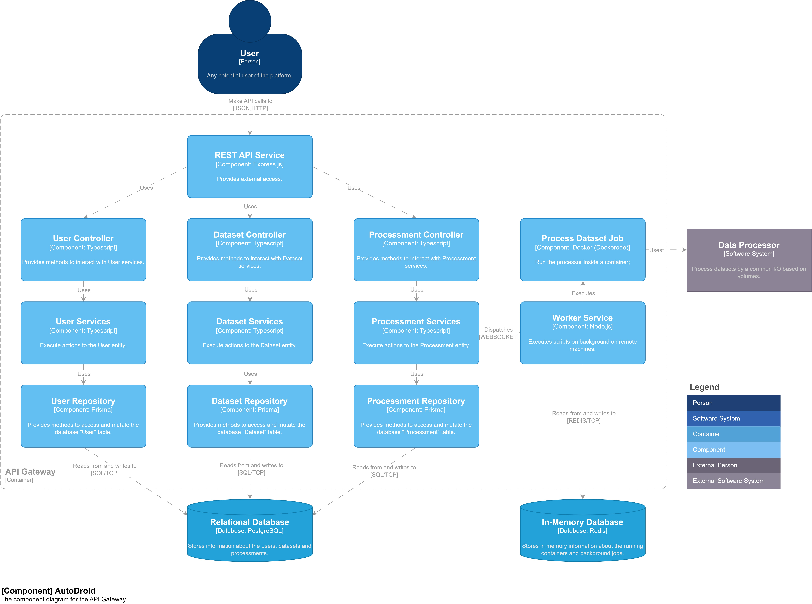
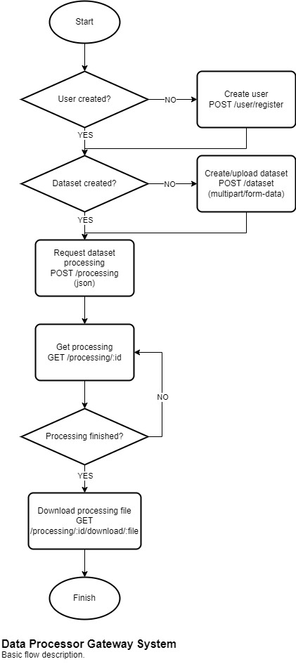

<p align="center">
  <a href="" rel="noopener">
    
  </a>
</p>

<h3 align="center">AutoDroid</h3>

<div align="center">

[]()

</div>

---

## 📝 Índice <a name="summary"></a>

- [📖 Sobre](#about)
- [✨ Visão Geral do Projeto](#overview)
- [✅ Requisitos Funcionais e Não Funcionais](https://docs.google.com/document/d/1tCNZw9VFt5honSpTOx_DjVQ7-l0qdYta)
- [📚 SDK](https://www.npmjs.com/package/autodroid)
- [🏦 Arquitetura](#architecture)
- [⛏️ Tecnologias Utilizadas](#built_using)
- [💻 Ambiente do Usuário](#user_environment)
- [📡 Ambiente do Servidor](#server_environment)
- [🏁 Primeiros Passos](#getting_started)
- [📱 Utilização](#usage)
- [✅ Testes](#tests)
- [🚀 Deployment](#deployment)
- [🔃 Atualizando](#updating)
- [🔧 Solução de Problemas](#troubleshooting)
- [🤝🏻 Contribuições](./CONTRIBUTING.md)
- [💾 Changelog](./CHANGELOG.md)
- [📖 Referências](#bibliography)

## 📖 Sobre <a name = "about"></a>

Este repositório contém o código da API AutoDroid.

### Motivação

Os Hackers do Mal estão utilizando técnicas de IA (Inteligência Artificial) para realizar “mutações” em malware, dificultando sua detecção, que afeta os usuários de computadores e dispositivos móveis, dentre outras tecnologias que possam estar sujeitas a ataque de malware, gerando um aumento do nível de proliferação de malware: um dos maiores desafios da segurança da informação.

Os Hackers do Bem podem enfrentar esta proliferação de malwares utilizando ferramentas de IA como o DroidAugmentor para que a detecção dos malwares “mutantes” seja amplamente aprimorada.

Todavia ferramentas tais como a DroidAugmentor manualmente pode ser uma tarefa muito complexa e nada escalável, criando uma grande barreira de aprendizagem e utilização da ferramenta.

Encapsular aplicativos em contêineres Docker pode ser uma solução para esse problema, mas ainda é um processo muito manual e não é muito fácil de gerenciar.

### Solução

Ao oferecer ferramentas como a DroidAugmentor como um serviço, torna sua execução escalável, de fácil aprendizado e com melhor aproveitamento para experimentação.

A AutoDroid é uma aplicação que visa oferecer aplicações como a DroidAugmentor como um serviço, tornando sua execução escalável, de fácil aprendizado e com melhor aproveitamento para experimentação.

## ✨ Visão Geral do Projeto <a name="overview"></a>

O serviço proposto se trata da etapa de expansão de Dataset na pipeline de AutoML, conforme apresentado em [DroidAugmentor](https://sol.sbc.org.br/index.php/sbseg_estendido/article/view/27273).



O projeto é composto por diversas partes, com o objetivo final de oferecer uma ferramenta escalável para executar instâncias da DroidAugmentor.



## 🏦 Arquitetura <a name="architecture"></a>

Esta aplicação é uma API REST/GraphQL construída usando Typescript com Node.js, Express e TypeGraphQL.

Seguindo o [modelo C4](https://c4model.com/), a arquitetura do back-end é apresentada a seguir:

Visão de sistema:


Visão de contêiner:


Visão de componente:


### Entidades

- `User`: representa um usuário da aplicação. Nenhum dado pessoal é coletado, é apenas um identificador anônimo.
- `File`: representa um arquivo, que pode ser um dataset ou resultado de processamento, por exemplo.
- `Processor`: representa um processador que será usado para processar um conjunto de dados. É uma imagem Docker que será usada para processar a solicitação de processamento do usuário com os parâmetros fornecidos.
- `Dataset`: representa um conjunto de dados que será usado por um processador, é um arquivo que será usado como entrada para o processador.
- `Processing`: representa uma solicitação de processamento feita por um usuário. É uma solicitação para processar um conjunto de dados usando um processador com os parâmetros fornecidos. Todo o ciclo de vida do processamento está disponível nesta entidade, incluindo o status de execução e seu resultado.
- `Worker`: representa uma instância da aplicação Worker, que é responsável por processar os jobs em background.

### Estrutura do código

A estrutura interna é apresentada em [estrutura do código](./CODEBASE_STRUCTURE.md) e guiada pelo documento de [Guidelines de Código](./CODE_GUIDELINES.md).

A proposta de arquitetura do back-end é baseada em [DDD](https://en.wikipedia.org/wiki/Domain-driven_design) e [Clean Architecture](https://blog.cleancoder.com/uncle-bob/2012/08/13/the-clean-architecture.html). É guiada por princípios de SOLID e visa a separação de responsabilidades, facilitando a manutenção e evolução do código. Além disso, é proposto o método de desenvolvimento [TDD](https://en.wikipedia.org/wiki/Test-driven_development) para garantir a qualidade do código guiado por testes.

## ⛏️ Tecnologias Utilizadas <a name = "built_using"></a>

- [TypeScript](https://www.typescriptlang.org/) - Linguagem de programação
- [Node.js](https://nodejs.org/) - Ambiente de execução
- [Express](https://www.fastify.io/) - Framework web
- [Docker](https://www.docker.com/) - conteinerização
- [PostgreSQL](https://www.postgresql.org/) - Banco de dados
- [Redis](https://redis.io/) - Banco de dados em memória
- [Tsyringe](https://github.com/microsoft/tsyringe) - Injeção de dependência
- [Prisma](https://www.prisma.io/) - ORM
- [Bull](https://optimalbits.github.io/bull/) - Gerenciador de filas
- [Dockerode](https://github.com/apocas/dockerode) - API Docker
- [Vitest](https://vitest.dev/) - Framework de testes
- [Yarn](https://yarnpkg.com/) - Gerenciador de pacotes

### Geral

É importante mencionar as demais ferramentas que serão utilizadas nas duas partes do projeto:

- [Git](https://git-scm.com/) - Controle de versão
- [Husky](https://typicode.github.io/husky/#/) - Hooks do Git
- [Lint Staged](https://github.com/okonet/lint-staged) - Ferramenta para verificar arquivos commitados
- [Commitizen](https://github.com/commitizen/cz-cli) - Auxiliar para mensagens de commit do Git
- [Commitlint](https://commitlint.js.org/) - Verificador de mensagens de commit do Git
- [Standard Version](https://github.com/conventional-changelog/standard-version) - Gerador de changelog
- [Eslint](https://eslint.org/) - Framework de verificação de código
- [Prettier](https://prettier.io/) - Formatador de código
- [Semver](https://semver.org/) - Versionamento semântico

## 💻 Ambiente do Usuário <a name="user_environment"></a>

O ambiente do usuário final (utilizador) deverá ter um dispositivo (seja fixo ou móvel) com acesso à internet e com ao menos uma ferramenta de navegação para acessar a versão web do produto ou um cliente de API REST/GraphQL (ex.: curl, httpie, postman, insomnia) previamente instalado em seu dispositivo.

## 📡 Ambiente do Servidor <a name = "server_environment"></a>

- Sistema operacional Linux (por exemplo, Ubuntu, Debian e outros...) (MacOS/Windows é experimental)
- Virtualização habilitada na BIOS
- Mínimo de 4GB de RAM
- Mínimo de 10GB de espaço livre em disco, dependendo dos "processadores" disponíveis (para arquivos, resultados de processamento, banco de dados e imagens Docker)
- [Git](https://git-scm.com/downloads) instalado
- [Docker](https://docs.docker.com/get-docker/) instalado

## 🚩 Antes de começar <a name = "before_start"></a>

Este projeto requer credenciais e chaves de acesso para a integração com serviços externos, sendo eles:
- Firebase: autenticação/autorização
- Google Cloud Storage: armazenamento de arquivos

O requisito "Google Cloud Storage" pode ser provido pela mesma conta do requisito "Firebase", tanto como pode ser uma conta/projeto Google distinto.

### Firebase

- Entre na conta Google que será utilizada para gerenciar o projeto.
- Acesse o [Firebase Console](https://console.firebase.google.com/).
- Crie um novo projeto ou utilize um projeto existente.
- Inicie o [Firebase Authentication](https://console.firebase.google.com/project/_/authentication/providers).
- Habilite o provedor de autenticação Email.
- Habilite o provedor de autenticação Google.
- Inicie o [Firebase Storage](https://console.firebase.google.com/project/_/storage).
- Crie um novo bucket ou utilize um bucket existente, coletando o valor ```nome``` do bucket.
- Crie a aplicação web e armazene os dados de configuração a serem usados pelo frontend posteriormente.
- Crie uma [conta de serviço (service account) para SDK Admin do Firebase](https://console.firebase.google.com/project/_/settings/serviceaccounts/adminsdk).
- Crie uma chave de acesso JSON para a conta de serviço e salve o arquivo em um local seguro.

- Coletado o ```nome``` do bucket e a chave de acesso JSON, [prossiga para a configuração das variáveis de ambiente](#env_variables).

Para mais detalhes, foi desenvolvido o [tutorial detalhado sobre como configurar o Firebase (Authentication + Storage) para a AutoDroid](./FIREBASE_SETUP_EXAMPLE.md).

### Google Cloud Storage

- Entre na conta Google que será utilizada para gerenciar o projeto.
- Acesse o [Google Cloud Console](https://console.cloud.google.com/).
- Crie um novo projeto ou utilize um projeto existente.
- Ative a [API do Google Cloud Storage](https://console.cloud.google.com/apis/library/storage.googleapis.com).
- Verifique se o projeto possui uma [conta de faturamento](https://console.cloud.google.com/billing) caso necessário.
- Crie um [novo bucket ou utilize um bucket existente](https://console.cloud.google.com/storage/browser), coletando o valor ```nome``` do bucket.
- Crie uma [nova conta de serviço (service account) ou utilize uma existente](https://console.cloud.google.com/iam-admin/serviceaccounts).
- Verifique se a conta de serviço possui a [permissão de escrita no bucket selecionado](https://cloud.google.com/storage/docs/access-control/iam-roles).
- Crie uma [chave de acesso JSON para a conta de serviço](https://cloud.google.com/iam/docs/keys-create-delete) e salve o arquivo em um local seguro.

- Coletado o ```nome``` do bucket desejado e a chave de acesso JSON, [prossiga para a configuração das variáveis de ambiente](#env_variables).

### Variáveis de ambiente <a name = "env_variables"></a>

Os campos das seções ```#General```, ```#Database```, ```#Non-relational database``` e ```# Redis``` estão configurados para funcionarem adequadamente em ambiente Docker, altere conforme necessário.

O campo ```CORS_ALLOWED_FROM``` é configurado para aceitar requisições de qualquer origem, altere conforme necessário.

Os campos da seção ```#Providers``` são obrigatórios para o funcionamento da aplicação e devem ser preenchidos com os valores coletados anteriormente.

- (Obrigatório) Preencha os campos ```FIREBASE_AUTHENTICATION_PROVIDER_PROJECT_ID```, ```FIREBASE_AUTHENTICATION_PROVIDER_CLIENT_EMAIL``` e ```FIREBASE_AUTHENTICATION_PROVIDER_PRIVATE_KEY``` com os valores da conta de serviço do Firebase.
- (Obrigatório) Preencha os campos ```GOOGLE_STORAGE_PROVIDER_PROJECT_ID```, ```GOOGLE_STORAGE_PROVIDER_CLIENT_EMAIL``` e ```GOOGLE_STORAGE_PROVIDER_PRIVATE_KEY``` e ```GOOGLE_STORAGE_PROVIDER_BUCKET_NAME``` com os valores da conta de serviço do Google Cloud Storage (ou Firebase Storage, com o nome do bucket coletado em ```Criação → Storage``` sem o prefixo ```gs://```).

Os campos ```#Feature``` devem ser ajustados conforme suas preferências para o funcionamento.

- (Obrigatório) Preencha o campo ```ADMIN_EMAILS``` com os emails dos administradores separados por vírgula.
- (Obrigatório) O campo ```JOBS_ENABLED``` deve ser preenchido com ```true``` para habilitar o processamento de jobs em background.
- (Obrigatório) Os campos ```WORKER_REFRESH_TOKEN_SECRET``` e ```WORKER_ACCESS_TOKEN_SECRET``` são obrigatórios e devem ser preenchidos com valores aleatórios para garantir a segurança da aplicação.

Os campos opcionais podem ficar vazios (exemplo: ```CAMPO=```, deixando nenhum valor após o sinal de igualdade ```=```), caso não deseje especificar um valor

- (Opcional) Preencha o campo ```SENTRY_DSN``` com a chave fornecida pelo [Sentry](https://sentry.io/) caso desejado.
- (Opcional) Preencha os campos ```STORAGE_PROVIDER_PUBLIC_READ_URL_EXPIRATION```, ```STORAGE_PROVIDER_PUBLIC_WRITE_URL_EXPIRATION```, ```WORKER_REFRESH_TOKEN_EXPIRATION```, ```WORKER_ACCESS_TOKEN_EXPIRATION```, ```PROCESSING_DEFAULT_KEEP_UNTIL``` e ```PROCESSING_ALLOWED_KEEP_UNTIL_EXTEND``` [conforme a especificação da biblioteca ms](https://www.npmjs.com/package/ms).

## 🏁 Primeiros Passos <a name = "getting_started"></a>

Estas instruções irão ajudá-lo a obter uma cópia deste projeto e executá-lo em sua máquina local para fins de desenvolvimento e teste. Consulte [deployment](#deployment) para obter informações sobre como implantar o projeto em ambiente produtivo.

Verifique se você atende aos [requisitos do ambiente do servidor](#server_environment) antes de começar.

Execute todos os passos de [antes de começar](#before_start). Salve todos certificados e chaves de acesso em um local seguro.

Existem duas maneiras de instalar esta aplicação: [utilizando o Docker (recomendado)](#docker_setup) ou [manualmente](#manual_setup).

### Instalação via Docker (recomendado) <a name="docker_setup"></a>

Usando o terminal, clone este repositório em sua máquina local usando o Git:

```bash
git clone https://github.com/MalwareDataLab/AutoDroid.git
```

Navegue até a pasta do repositório:

```bash
cd autodroid
```

Atualize o repositório sempre, utilizando:

```bash
git pull
```

Inicie o projeto:

```bash
docker compose up --build
```

Este script irá iniciar a aplicação usando o Docker compose.
A inicialização da aplicação pode levar alguns minutos, dependendo da sua conexão com a internet e do tamanho dos "processadores" fornecidos.
O terminal deve ser mantido aberto durante a execução da aplicação.

Se a inicialização for bem-sucedida, você verá algumas mensagens no console, como por exemplo:

```bash
autodroid_api_gateway_prod  | 🆗 Database connection success.
autodroid_api_gateway_prod  | 🆗 Redis default connection success.
autodroid_api_gateway_prod  | 🆗 Image someImage:latest loaded.
autodroid_api_gateway_prod  | 🆗 Docker dataset processor provider connection success.
autodroid_api_gateway_prod  | 🆗 Processing background jobs on @autodroid/api.
autodroid_api_gateway_prod  | ⚡️ @autodroid/api production version X using Node.js X running at port 3333 with PID X.
```

Prossiga para a seção [utilização](#usage) para obter informações sobre como usar a aplicação.

Para parar a aplicação, pressione ```Ctrl + C``` no terminal ou execute ```docker compose down``` na raiz deste repositório, caso esteja executando a aplicação em modo destacado.

Uma pasta `./runtime` será criada na raiz deste repositório para armazenar os arquivos temporários da aplicação. Pode ser necessário permissões de superusuário para acessar, modificar ou excluir esta pasta.

### Instalação Manual <a name="manual_setup"></a>

Um guia para configurar o projeto manualmente está disponível no guia de [configuração manual](./MANUAL_SETUP.md).

## 📱 Utilização <a name="usage"></a>

Esta aplicação fornece uma API REST/GraphQL no ambiente Docker compose.

Por padrão, estará disponível em sua máquina local nos seguintes URLs:
- API REST (porta 3333): http://localhost:3333
- API GraphQL (porta 3333): http://localhost:3333/graphql

Esta URL estará disponível até que a aplicação seja interrompida.

Para usar a API diretamente, você pode seguir as instruções na [documentação da API](./API.md) ou pode usar ferramentas de cliente HTTP como [Postman](https://www.postman.com/) ou [Insomnia](https://insomnia.rest/).

Todas as rotas, queries e mutations da API estão disponíveis [nesta coleção do Postman](https://www.postman.com/luizfelipelaviola/workspace/autodroid/collection/17242387-d69ee1f8-a603-4ac8-89aa-787cfacffaee?action=share&creator=17242387&active-environment=17242387-9dcb7b8e-4eb1-4a10-b607-74725449575f).

### Usuário/Autorização

Esta aplicação usa autenticação através do provedor Firebase, sendo necessário o envio do header `Authorization` em cada requisição, com o respectivo valor `Bearer ${token}`.

### Processador

O processador é uma aplicação (imagem Docker) a ser registrada pelo adminsitrador para ser utilizada pelos usuários para processar conjuntos de dados. [Exemplo de requisição](https://www.postman.com/luizfelipelaviola/workspace/autodroid/request/17242387-72c95160-e485-466b-a22b-2dc7a201aeb0?action=share&source=copy-link&creator=17242387&ctx=documentation).

### Dataset

O arquivo de conjunto de dados pode ser enviado pelo usuário usando a API. O arquivo de conjunto de dados deve ser um arquivo válido com um tipo MIME válido, de acordo com a configuração do processador.

Há um [dataset de exemplo](./samples/dataset_example.csv) na pasta ```./docs/samples``` deste repositório que você pode usar para testar a aplicação.

O envio é feito por URL assinada, a funcionalidade de `Create dataset` irá fornecer uma `upload_url`, para onde o arquivo de fato deverá ser enviado. [Exemplo de requisições](https://www.postman.com/luizfelipelaviola/workspace/autodroid/folder/17242387-303cd191-1127-448c-920c-18bc5f9d0e46?action=share&source=copy-link&creator=17242387&ctx=documentation).

### Processamento

Obtidos o `processor_id` e `dataset_id` a partir da criação dos dois passos anteriores, o usuário pode solicitar o processamento do conjunto de dados, seja com os parâmetros predefinidos ou customizados. [Exemplo de requisição](https://www.postman.com/luizfelipelaviola/workspace/autodroid/request/17242387-3c8296fb-5506-428c-95d2-8abc65cc92bc?action=share&source=copy-link&creator=17242387&ctx=documentation).

O resultado pode ser obtido através do download do arquivo zip fornecido pelo campo `public_url` após a conclusão do processamento (campo `status`). [Exemplo de requisição](https://www.postman.com/luizfelipelaviola/workspace/autodroid/request/17242387-6f8c7085-04f4-47d0-8f83-abe90fbffd25?action=share&source=copy-link&creator=17242387&ctx=documentation).

### Worker

O worker é uma aplicação (imagem Docker) que será utilizada para processar os jobs em background. O worker é uma aplicação separada da API e deve ser configurada para funcionar corretamente.

Inicialmente o administrador cria um `WorkerRegistrationToken` onde o campo `token` será utilizado para autenticar a aplicação com o backend. [Exemplo de requisição](https://www.postman.com/luizfelipelaviola/workspace/autodroid/request/17242387-bddce5bd-44f1-4ccc-89f3-aee615c7e7d6?action=share&source=copy-link&creator=17242387&ctx=documentation).

Siga as instruções em [worker](https://github.com/MalwareDataLab/autodroid-worker) para a instalação e configuração do worker.

### Fluxo comum

O fluxograma a seguir descreve o fluxo comum da aplicação:

<p align="center">
  
</p>

## ✅ Testes <a name = "tests"></a>

Foi disponibilizado um script de demonstração ponta-a-ponta para a aplicação, que pode ser executado com o comando:

```bash
./demo.sh
```

Para executar os testes, por favor execute o comando abaixo:
```bash
yarn test
```

A cobertura de código e outros relatórios serão gerados na pasta `./test/outputs`.

## 🚀 Deployment <a name = "deployment"></a>

Esta aplicação está pronta para implantação com Docker e docker compose.

Para disponibilizar esta aplicação em ambiente produtivo:

Realize o download na pasta desejada:

```bash
git clone https://github.com/MalwareDataLab/AutoDroid.git
```

Atualize o repositório utilizando:

```bash
git pull
```

Complete os mesmos processos citados anteriormente em [antes de começar](#before_start).

Realize o processo de construção da imagem Docker utilizando:

```bash
docker compose build --no-cache
```

Depois que a aplicação for construída, preencha e verifique o arquivo ```docker-compose.yml``` com suas variáveis de ambiente (conforme especificado em [antes de começar](#before_start)) e execute o seguinte comando:

```bash
docker compose up -d
```

A aplicação estará disponível na porta 3333 (configuração padrão), para alterar, modifique o arquivo ```docker-compose.yml``` e reinicie a aplicação utilizando o comando ```docker compose restart```.

Configure sua rede local e as portas do firewall para permitir o acesso à aplicação.

Verifique as restrições da sua rede local e ISP.

## 🔃 Atualizando <a name = "updating"></a>

O docker compose está instrumentado com a ferramenta [watchtower](https://containrrr.dev/watchtower/) para atualizações automáticas.

Para realizar atualização manual, execute o seguinte comando:

```bash
docker compose down
docker compose pull
docker compose up -d
```

## 🔧 Solução de Problemas <a name = "troubleshooting"></a>

O Docker é incrível, mas às vezes pode ser um pouco complicado. Alguns erros podem ocorrer durante a execução da aplicação, e alguns deles podem estar relacionados ao Docker.

### Erros antes da inicialização

Se você estiver enfrentando alguns erros antes da inicialização da aplicação, verifique os seguintes itens:

- Verifique se a máquina atende aos [requisitos](#server_environment).
- Verifique se todos os passos especificados em [antes de começar](#before_start) foram completados, refaça-os se necessário.
- Verifique se seu usuário possui permissões de uso ao Docker, executando o comando `docker run --rm hello-world:latest`.
- Realize os processos de pós-instalação do Docker, conforme [documentação oficial](https://docs.docker.com/engine/install/linux-postinstall/).

### Limpando o ambiente do Docker

Se você estiver enfrentando alguns erros relacionados ao Docker, você pode tentar limpar o ambiente do Docker executando os seguintes comandos:

```bash
# Pare todos os containers
docker compose down
docker stop $(docker ps -q)

# Remova todos os arquivos da pasta runtime
sudo rm -rf ./.runtime

# Remova todas as imagens relacionadas a este projeto
docker rmi $(docker images -q -f "reference=autodroid_*")

# Reinicie o serviço de rede
sudo systemctl restart NetworkManager.service

# (Opcional) Limpe o ambiente do Docker
docker system prune -a
```

### Verificando as etapas de inicialização

Se você estiver enfrentando alguns erros durante a inicialização da aplicação, você pode verificar as etapas da inicialização executando os seguintes comandos:

```bash
# Tente usar qualquer imagem do Docker Hub que não esteja em sua máquina para verificar se o Docker instalado está funcionando como esperado
docker rmi hello-world
docker run --rm hello-world:latest

# Tente construir a aplicação manualmente, em caso de erro, envie a mensagem de erro para o mantenedor do projeto
docker compose build --no-cache
```

Persistindo o erro, entre em contato com o mantenedor do projeto.

## 📖 Referências <a name="bibliography"></a>

CASOLA, Karina; PAIM, Kayuã Oleques; MANSILHA, Rodrigo Brandão; KREUTZ, Diego. DroidAugmentor: uma ferramenta de treinamento e avaliação de cGANs para geração de dados sintéticos. In: SALÃO DE FERRAMENTAS - SIMPÓSIO BRASILEIRO DE SEGURANÇA DA INFORMAÇÃO E DE SISTEMAS COMPUTACIONAIS (SBSEG), 23. , 2023, Juiz de Fora/MG. Anais [...]. Porto Alegre: Sociedade Brasileira de Computação, 2023 . p. 57-64. DOI: https://doi.org/10.5753/sbseg_estendido.2023.235793.

LAVIOLA, Luiz Felipe; PAIM, Kayuã Oleques; KREUTZ, Diego; MANSILHA, Rodrigo Brandão. AutoDroid: disponibilizando a ferramenta DroidAugmentor como serviço. In: ESCOLA REGIONAL DE REDES DE COMPUTADORES (ERRC), 20. , 2023, Porto Alegre/RS. Anais [...]. Porto Alegre: Sociedade Brasileira de Computação, 2023 . p. 145-150. DOI: https://doi.org/10.5753/errc.2023.929.
